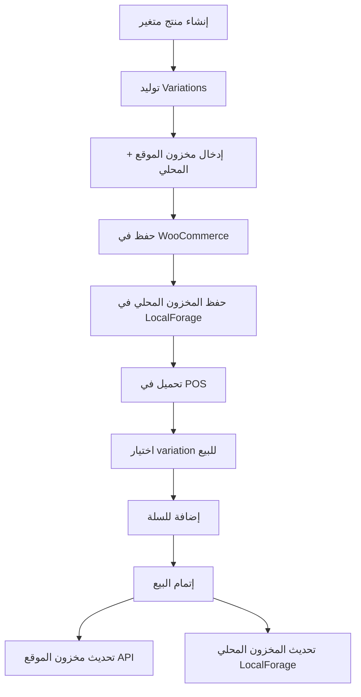

# 📦 نظام المخزون المحلي للمتغيرات
## Variable Products Local Stock System

---

## 🎯 نظرة عامة

تم تطوير نظام شامل لإدارة المخزون المحلي للمنتجات المتغيرة (Variable Products) في النظام. كل variation الآن له:
1. **مخزون الموقع (WooCommerce)** 🌐 - المخزون المتاح للبيع أونلاين
2. **مخزون المحل المحلي** 🏪 - المخزون الفعلي في المحل

---

## 🏗️ البنية التقنية

### 1. تخزين البيانات (warehouse-storage.js)

تم إضافة 4 دوال جديدة لإدارة المخزون المحلي للمتغيرات:

```javascript
// حفظ المخزون المحلي لمتغير واحد
await warehouseStorage.setVariationLocalStock(variationId, localStock);

// جلب المخزون المحلي لمتغير
const localStock = await warehouseStorage.getVariationLocalStock(variationId);

// جلب كل المخزون المحلي
const allStocks = await warehouseStorage.getAllVariationLocalStocks();

// حفظ مخزون محلي لعدة متغيرات دفعة واحدة
await warehouseStorage.setMultipleVariationLocalStocks([
  { id: 123, localStock: 50 },
  { id: 124, localStock: 30 }
]);
```

**التخزين:**
- يتم الحفظ في `localforage` تحت مفتاح `'variation-local-stocks'`
- البنية: `{ [variationId]: { localStock: number, updatedAt: timestamp } }`

---

### 2. نموذج المنتج (ProductForm.js)

#### إضافة المنتجات المتغيرة:

```javascript
// عند توليد المتغيرات
const newVariations = combinations.map((combo, index) => ({
  id: `temp_${Date.now()}_${index}`,
  attributes: combo,
  sku: `${baseSku}-${index + 1}`,
  price: form.sellingPrice || '0',
  stock_quantity: 0,      // 🌐 مخزون الموقع
  localStock: 0,          // 🏪 مخزون المحل
  manage_stock: true,
  image: null
}));
```

#### واجهة المستخدم:

تم تعديل الـ Variation Editor ليعرض حقلين منفصلين:

```html
<div className="grid md:grid-cols-5 gap-3">
  <div>
    <label>🌐 مخزون الموقع</label>
    <input 
      type="number" 
      value={variation.stock_quantity}
      className="bg-blue-50"
      title="المخزون في WooCommerce"
    />
  </div>
  
  <div>
    <label>🏪 مخزون المحل</label>
    <input 
      type="number" 
      value={variation.localStock}
      className="bg-green-50"
      title="المخزون المحلي في المحل"
    />
  </div>
</div>
```

**الألوان المستخدمة:**
- 🔵 مخزون الموقع: خلفية `bg-blue-50`
- 🟢 مخزون المحل: خلفية `bg-green-50`

#### الحفظ:

```javascript
// عند إنشاء منتج متغير جديد
const handleVariableProductSubmit = async () => {
  // ... إنشاء المنتج الأساسي ...
  
  const createdVariations = [];
  
  for (const variation of variations) {
    // إنشاء variation في WooCommerce
    const variationResponse = await fetch(`/api/products/${parentId}/variations`, {
      method: 'POST',
      body: JSON.stringify({
        stock_quantity: parseInt(variation.stock_quantity) || 0,
        // ... باقي البيانات
      })
    });
    
    const variationResult = await variationResponse.json();
    
    // تجميع IDs للمخزون المحلي
    createdVariations.push({
      id: variationResult.variation.id,
      localStock: variation.localStock || 0
    });
  }
  
  // حفظ المخزون المحلي لكل المتغيرات دفعة واحدة
  await warehouseStorage.setMultipleVariationLocalStocks(createdVariations);
};
```

#### التحميل في وضع التعديل:

```javascript
const loadProductData = async () => {
  // ... جلب بيانات المنتج ...
  
  if (product.type === 'variable' && product.variations.length > 0) {
    // جلب المخزون المحلي لكل متغير
    const variationsWithLocalStock = await Promise.all(
      product.variations.map(async (v) => {
        const localStock = await warehouseStorage.getVariationLocalStock(v.id);
        return {
          ...v,
          localStock: localStock || 0
        };
      })
    );
    
    setVariations(variationsWithLocalStock);
  }
};
```

---

### 3. صفحة الكاشير (pos/page.js)

#### تحميل المتغيرات مع المخزون المحلي:

```javascript
const handleSelectVariation = async (product) => {
  // جلب variations من API
  const res = await fetch(`/api/products/${product.id}/variations`);
  const data = await res.json();
  
  // إضافة المخزون المحلي لكل variation
  const { warehouseStorage } = await import('@/app/lib/warehouse-storage');
  const variationsWithLocalStock = await Promise.all(
    data.variations.map(async (v) => {
      const localStock = await warehouseStorage.getVariationLocalStock(v.id);
      return {
        ...v,
        localStock: localStock || 0
      };
    })
  );
  
  setVariationSelectorVariations(variationsWithLocalStock);
};
```

---

### 4. عرض المتغيرات (VariationSelector.js)

تم تحديث واجهة اختيار المتغيرات لعرض المخزونين:

```jsx
<div className="space-y-1.5">
  {/* Stock - API & Local */}
  <div className="flex items-center gap-3">
    <span className="text-sm font-semibold text-blue-600">
      🌐 موقع: {selectedVariation.stock_quantity}
    </span>
    
    {selectedVariation.localStock !== undefined && (
      <span className="text-sm font-semibold text-green-600">
        🏪 محلي: {selectedVariation.localStock}
      </span>
    )}
  </div>
</div>
```

**الألوان الديناميكية:**
- مخزون > 5: أخضر 🟢
- مخزون 1-5: برتقالي 🟠
- مخزون = 0: رمادي ⚪️

---

### 5. معالجة البيع (pos-store.js)

#### تحديث المخزون المحلي عند البيع:

```javascript
const processCheckout = async (paymentDetails) => {
  // ... معالجة الدفع ...
  
  // تحديث المخزون المحلي للمتغيرات
  try {
    for (const item of cart) {
      if (item.variation_id) {
        // هذا variation - محتاج نحدث المخزون المحلي
        const currentLocalStock = await warehouseStorage.getVariationLocalStock(item.variation_id);
        const newLocalStock = Math.max(0, currentLocalStock - item.quantity);
        await warehouseStorage.setVariationLocalStock(item.variation_id, newLocalStock);
        
        console.log(`✅ تم تحديث المخزون المحلي للمتغير ${item.variation_id}: ${currentLocalStock} → ${newLocalStock}`);
      }
    }
  } catch (error) {
    console.error('❌ فشل تحديث المخزون المحلي للمتغيرات:', error);
    // لا نوقف العملية
  }
};
```

**الآلية:**
1. التحقق من وجود `variation_id` في المنتج
2. جلب المخزون المحلي الحالي
3. خصم الكمية المباعة
4. حفظ المخزون الجديد
5. تسجيل العملية في Console

---

## 🔄 دورة حياة البيانات



---

## 📊 مثال عملي

### سيناريو: قميص متعدد الألوان

**المنتج الأساسي:**
- الاسم: "قميص قطني"
- النوع: Variable Product
- السمات: اللون (أحمر، أزرق، أخضر)

**المتغيرات:**

| Variation | مخزون الموقع 🌐 | مخزون المحل 🏪 |
|-----------|-----------------|----------------|
| قميص أحمر | 10 | 50 |
| قميص أزرق | 15 | 30 |
| قميص أخضر | 5 | 20 |

**عند البيع:**
- العميل يشتري 2 قميص أحمر
- النظام يخصم من:
  - مخزون الموقع: 10 → 8 (عبر WooCommerce API)
  - مخزون المحل: 50 → 48 (عبر LocalForage)

---

## ⚙️ التكوين

### LocalForage Key Structure

```json
{
  "variation-local-stocks": {
    "123": {
      "localStock": 50,
      "updatedAt": "2025-12-16T10:30:00.000Z"
    },
    "124": {
      "localStock": 30,
      "updatedAt": "2025-12-16T10:30:00.000Z"
    }
  }
}
```

### Cart Item Structure (للمتغيرات)

```javascript
{
  id: 456,                    // Product ID (parent)
  variation_id: 123,          // Variation ID
  name: "قميص قطني - أحمر",
  price: "150",
  quantity: 2,
  stock_quantity: 10,         // 🌐 مخزون الموقع
  localStock: 50,             // 🏪 مخزون المحل (optional)
  is_variation: true,
  parent_id: 456,
  parent_name: "قميص قطني",
  variation_attributes: [
    { name: "اللون", option: "أحمر" }
  ]
}
```

---

## 🧪 الاختبار

### خطوات الاختبار الشاملة:

1. **إنشاء منتج متغير:**
   - ✅ إضافة سمات (Attributes)
   - ✅ توليد variations
   - ✅ إدخال مخزون موقع ومحلي مختلف لكل variation
   - ✅ حفظ المنتج

2. **التحميل في POS:**
   - ✅ البحث عن المنتج
   - ✅ الضغط على "اختر" للمنتج المتغير
   - ✅ التحقق من ظهور المخزون الموقع والمحلي

3. **البيع:**
   - ✅ اختيار variation
   - ✅ إضافة للسلة
   - ✅ إتمام البيع
   - ✅ التحقق من تحديث المخزون المحلي

4. **إعادة التحميل:**
   - ✅ فتح المنتج للتعديل
   - ✅ التحقق من ظهور المخزون المحلي المحدث

---

## 🐛 معالجة الأخطاء

### السيناريوهات المحتملة:

1. **Variation بدون مخزون محلي:**
   ```javascript
   const localStock = await warehouseStorage.getVariationLocalStock(variationId);
   // إذا لم يُعثر عليه، يرجع 0
   ```

2. **فشل حفظ المخزون المحلي:**
   ```javascript
   try {
     await warehouseStorage.setVariationLocalStock(id, stock);
   } catch (error) {
     console.error('فشل حفظ المخزون المحلي:', error);
     // لا نوقف العملية - API update سيستمر
   }
   ```

3. **مخزون محلي سالب:**
   ```javascript
   const newLocalStock = Math.max(0, currentLocalStock - quantity);
   // دائماً نضمن عدم السالبية
   ```

---

## 📈 الميزات المستقبلية (اختياري)

- [ ] تقرير مقارنة بين مخزون الموقع والمحل
- [ ] تنبيهات عند التباين الكبير
- [ ] مزامنة تلقائية بين المخزونين
- [ ] تاريخ حركة المخزون المحلي
- [ ] جرد المخزون المحلي

---

## 📝 ملاحظات مهمة

1. **المخزون المحلي محلي فقط**: لا يتم مزامنته مع WooCommerce
2. **التحديث اليدوي**: المخزون المحلي يتطلب تحديث يدوي عند استلام شحنات جديدة
3. **للمتغيرات فقط**: المنتجات البسيطة تستخدم نظام مختلف (form.localStock)
4. **غير متزامن**: جميع العمليات async لتجنب blocking UI

---

## 👨‍💻 المطورين

عند التعامل مع variations، تذكر دائماً:
- استخدم `variation_id` وليس `id` فقط
- تحقق من `item.is_variation === true` قبل تحديث المخزون المحلي
- المخزون المحلي optional - لا تعتمد عليه في validation

---

## 📞 الدعم

لأي استفسارات حول نظام المخزون المحلي للمتغيرات:
- راجع ملف `warehouse-storage.js`
- تحقق من console logs أثناء البيع
- استخدم `getAllVariationLocalStocks()` للتفتيش

---

**آخر تحديث:** ديسمبر 2025  
**الإصدار:** 1.0.0  
**الحالة:** ✅ مكتمل وجاهز للإنتاج
